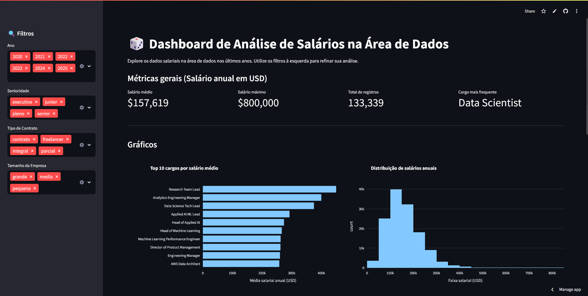

# 📊 Dashboard de Salários na Área de Dados - Alura

Este projeto é um **dashboard interativo** desenvolvido com [Streamlit](https://streamlit.io/) para análise de salários na área de dados.  
A aplicação permite explorar informações salariais filtrando por **ano**, **nível de senioridade**, **tipo de contrato** e **tamanho da empresa**, além de visualizar métricas e gráficos dinâmicos.

## Captura de Tela


## Link de acesso pelo streamlit
https://python-imersao-dados-alura.streamlit.app/

## 🚀 Funcionalidades

- **Filtros Interativos** na barra lateral:
  - Ano
  - Senioridade
  - Tipo de contrato
  - Tamanho da empresa

- **Métricas Principais**:
  - Salário médio anual (USD)
  - Salário máximo
  - Total de registros
  - Cargo mais frequente

- **Gráficos e Visualizações**:
  1. **Top 10 cargos por salário médio** (gráfico de barras)
  2. **Distribuição de salários anuais** (histograma)
  3. **Proporção dos tipos de trabalho** (presencial, remoto, híbrido)
  4. **Mapa mundial** com salário médio de Cientistas de Dados por país

- **Tabela de Dados Detalhados** filtrável e interativa

## 🛠 Tecnologias Utilizadas

- **[Python](https://www.python.org/)**
- **[Streamlit](https://streamlit.io/)** — Interface interativa
- **[Pandas](https://pandas.pydata.org/)** — Manipulação e filtragem de dados
- **[Plotly Express](https://plotly.com/python/plotly-express/)** — Criação de gráficos dinâmicos

## 📂 Estrutura dos Dados

O conjunto de dados é carregado a partir do arquivo CSV hospedado no GitHub:

```python
df = pd.read_csv("https://raw.githubusercontent.com/vqrca/dashboard_salarios_dados/refs/heads/main/dados-imersao-final.csv")
```

